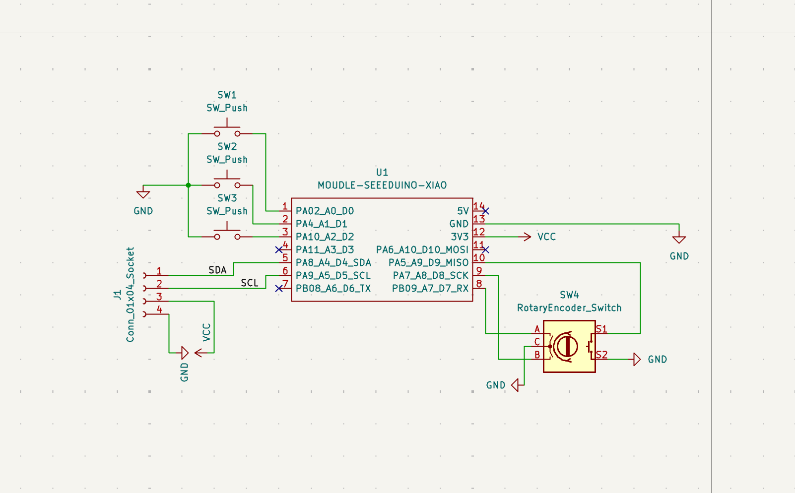
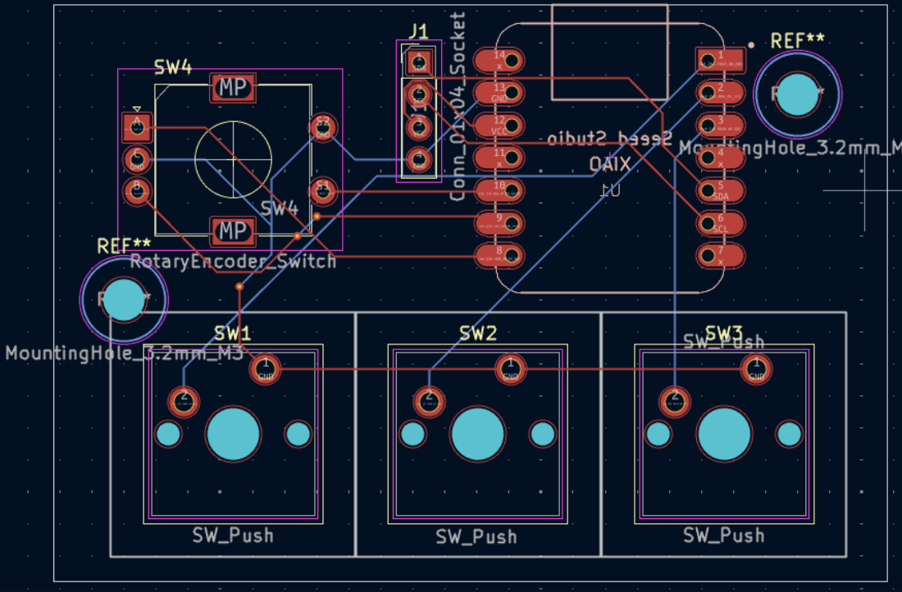
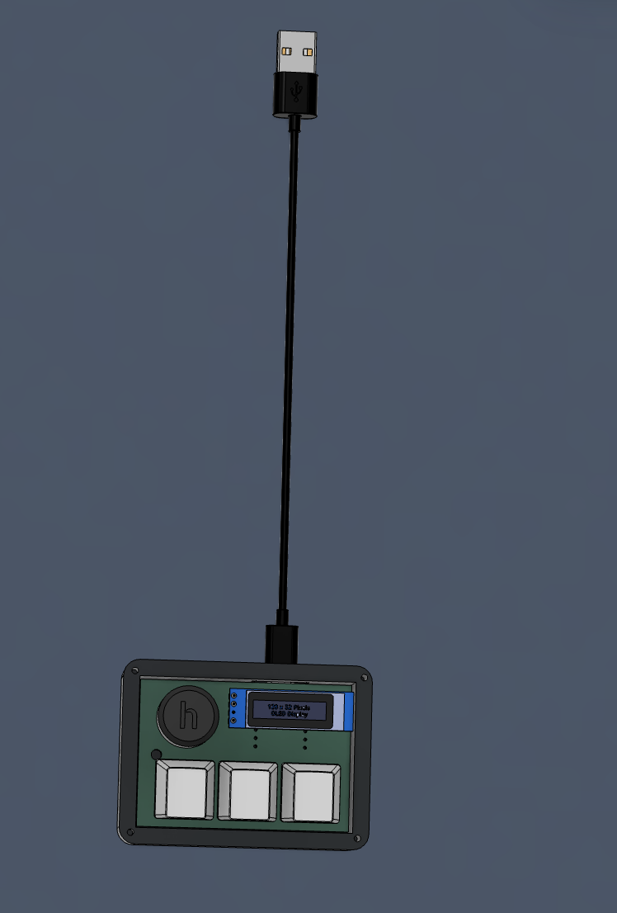

# Macropod-v3

I made a hackboard based on the pretty well known Sayo Device.

My Hackboard has a rotary encoder for volume control, 3 keys for macros/inputs. Currently in the QMK firmware it's been coded so the left key will press W on the keyboard, the middle key will do copy, and the right key will do paste. To make this Hackboard yourself you will need all the electronics in BOM plus get the custom PCB board made, the files for that are in gerbers in the production folder. After that you will need to 3d print all 3 of the parts for the case. Next you assemble the PCB board by sautering all of the pieces together. Finally you flash the Firmware into the RP2040 micro-controller and assemble the case for the sayo device.

## Schematics

## PCB

## CAD

## BOM
| Name | Purpose | Quantity | Total Cost (USD) | Link | Distributor |
|------|--------|----------|------------------|------|------------|
| Rotary Encoder | Dial input | 1 |0 | [Buy](https://robu.in/product/rotary-encoder-module/) | Robocraze |
| RP2040 | Microcontroller | 1 | 6.38 | [Buy](https://robocraze.com/products/seeed-studio-xiao-rp2040-development-board?variant=47742255562976&country=IN&currency=INR&utm_medium=product_sync&utm_source=google&utm_content=sag_organic&utm_campaign=sag_organic&campaignid=23145906364&adgroupid=182236965810&keyword=&device=c&gad_source=1&gad_campaignid=23145906364&gbraid=0AAAAADgHQvYlPzGMG3OcYMtb-BlPsfzhf&gclid=Cj0KCQjw77bPBhC_ARIsAGAjjV_IhuaGoKQTdTU_7luZl5Y1Wit55HdLdD95t0fOEzUk7gfg4P0fwLcaAqJXEALw_wcB) | Robocraze |
| Hot-Swappable Mechanical Keyboard Switches | Keys | 1 | 9.18 | [Buy](https://stackskb.com/store/click-inc-of-linear-switch-pack-of-10/) | Stacks |
| 3d printed comps | structure | 1 | 4| [Buy]() | printing legion|
| PCB | Circuit board | 1 | 9.94| [Buy](https://jlcpcb.com/) | JLCPCB |
| USB Type-C to Type-C Cable (Zebronics) | Power & Data | 1 | 2.11 | [Buy](https://www.amazon.in/dp/B0FJ2LY2JN) | Amazon |
| Keycaps | Keys | 1 | 1.06 | [Buy](https://stackskb.com/store/numpad-keycaps/) | Stacks |
